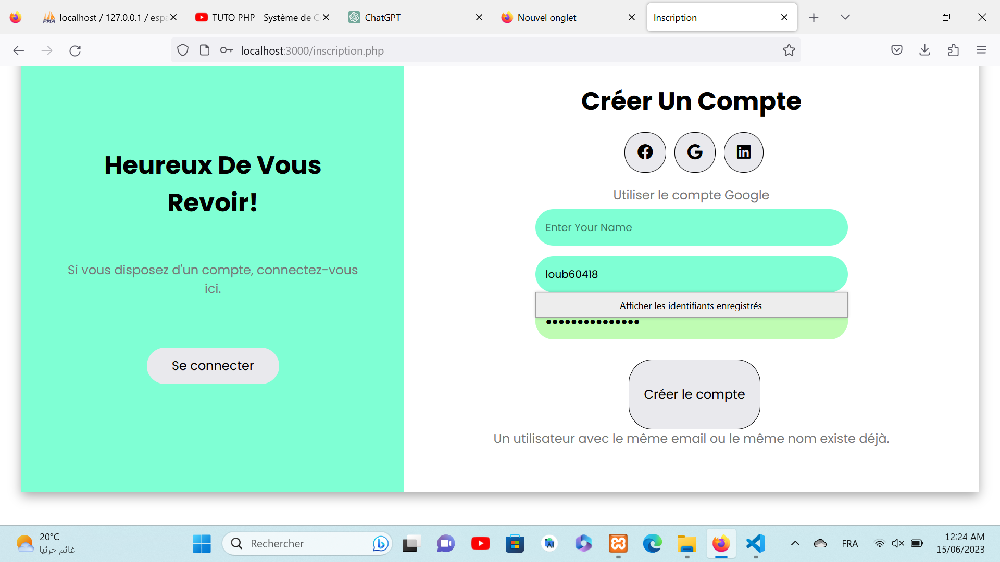

# Fashion Blog

This project is a modern, responsive fashion blog website designed to showcase fashion articles, trends, and tips. It features a clean and elegant design, leveraging the latest web technologies to provide a seamless user experience for browsing and reading blog posts.

## Technologies

The project is built using the following technologies:

- **HTML**: For structuring the content of the web pages.
- **CSS**: For styling and layout, including the use of CSS Grid and Flexbox for responsive design.
- **JavaScript**: For adding interactivity, such as navigation menu toggles, image sliders, and form validations.
- **Bootstrap**: For a responsive and mobile-first design framework.
- **PHP**: For server-side scripting and backend logic.
- **SQL**: For database management and queries.

## Project Demo

Here is a slideshow demonstration of the project:

## Features

- **Responsive Layout**: Optimized for viewing on desktops, tablets, and smartphones.
- **Smooth Navigation**: Includes a fixed navigation bar with smooth scrolling.
- **Home Section**: Features a hero image, latest articles, and call-to-action buttons.
- **Blog Section**: Display of blog posts with categories and filtering options.
- **Testimonials Section**: Slider to display reader feedback and testimonials.
- **Contact Section**: Contact form for users to get in touch, with additional contact details and map.
- **Footer**: Social media links, copyright information, and a back-to-top button.

